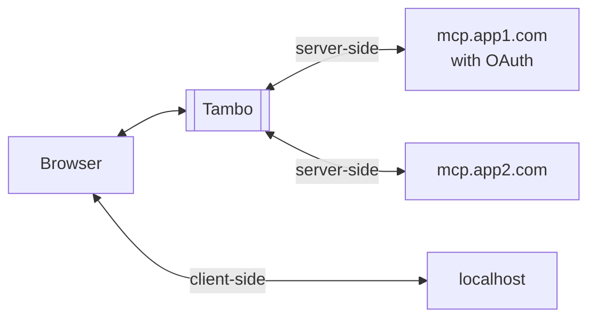
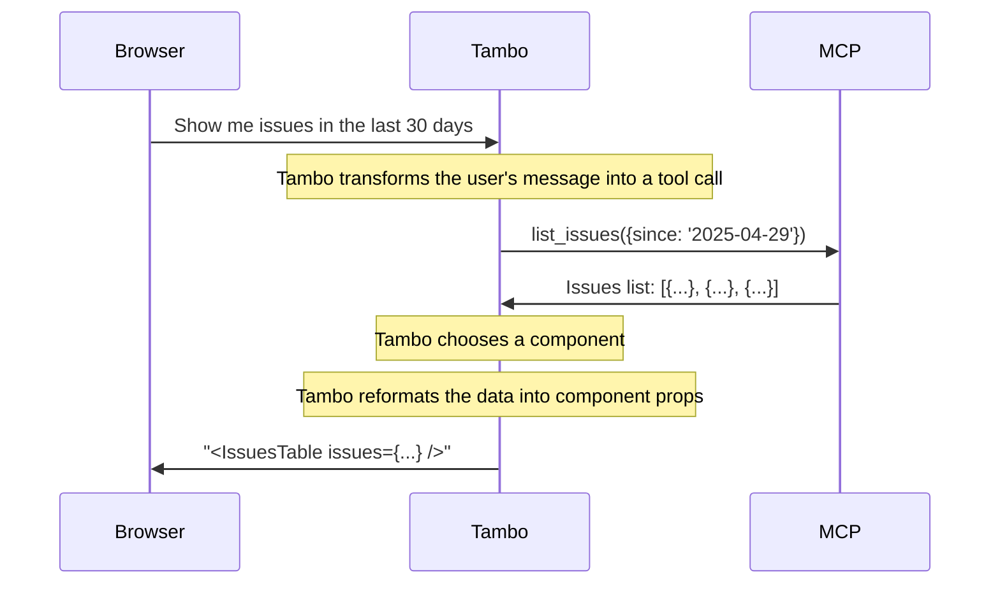
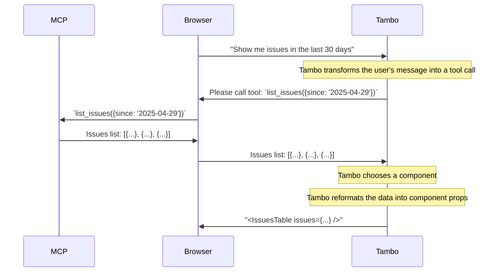

<Callout type="info" title="New Authentication Support!">
  Tambo now supports authenticated MCP servers when configured through the Tambo
  dashboard. See below for more details.
</Callout>

Model Context Protocol (MCP) enables AI applications to interact with external tools and services. Tambo provides support for MCP, allowing your agents to connect to various MCP servers and utilize their capabilities.

## What is MCP?

[MCP](https://modelcontextprotocol.io/) is a protocol that defines how AI models can discover, connect to, and interact with external tools, resources, and prompts. It enables models to:

- Discover available tools through a common interface
- Call external APIs to access data or perform actions
- Refer to resources, such as files, databases, or other data sources

## Tambo's MCP Support

When using Tambo with MCP servers, all of an MCP server's tools will be
available to Tambo. This is a great alternative to manually registering
tools in Tambo.

Future support for resources and prompts is in active development. Please reach out to us if you have specific use cases in mind.

Tambo offers two approaches for connecting to MCP servers: client-side and server-side.



### 1. Server-Side Support (recommended)

Server-side MCP integration allows you to configure MCP servers at the project
level through the Tambo dashboard. This generally gives the best end-user performance and
allows you to use OAuth-based authentication.

This approach is beneficial when:

- MCP servers need to be shared across all users of your application
- The MCP server is accessible from your Tambo backend
- You need to use an MCP server that requires authentication

To configure server-side MCP:

1. Navigate to [your project dashboard](https://tambo.co/dashboard)
2. Click on your project
3. Find the "MCP Servers" section
4. Click "Add MCP Server"
5. Enter the server URL and server type (StreamableHTTP or SSE), and click the save button.
6. Tambo will automatically detect if an MCP server requires authentication. If so, the "Begin Authentication" button will be shown. Click it to begin the authentication process.

Once configured, the MCP servers will be available to all users of your project without any additional client-side setup.

**Note:** _When an MCP server is authenticated, the authenticated user is currently shared across **all** users of the project. In the future Tambo will support per-user authentication._

If your server does not support OAuth-based authentication, you can add a custom header to the MCP server configuration. (e.g. `X-Api-Key`)

This is how server-side MCP works:



### 2. Client-Side Support

Client-side MCP integration allows your application to connect to MCP servers
that are accessible from the end user's browser, for instance when using a local
MCP server.

This is useful for:

- Local MCP servers running on the user's machine
- MCP servers where the user's browser is already authenticated
- Private or internal services behind a firewall, that are only visible from the user's browser

**Note:** _There is currently no support for authenticated MCP servers when using the client-side MCP provider_.

To implement client-side MCP support, use the `TamboMcpProvider` component inside your `TamboProvider`:

```tsx
import { TamboProvider } from "@tambo-ai/react";
import { TamboMcpProvider, MCPTransport } from "@tambo-ui/react/mcp";

function MyApp() {
  return (
    <TamboProvider components={...}>
      <TamboMcpProvider
        mcpServers={[
          {
            // MCP server configuration
            url: "http://localhost:8123/",
            // Optional custom headers, eg.
            // { "Authorization": `Bearer ${token}` } or { "X-Api-Key": "1234567890" }
            customHeaders: {},
            transport: MCPTransport.HTTP, // optional, defaults to SSE
          },
        ]}
      >
        {/* Your application components */}
      </TamboMcpProvider>
    </TamboProvider>
  );
}
```

The `TamboMcpProvider` establishes connections to the specified MCP servers and makes their tools available to Tambo agents in your application.

This is how client-side MCP works:



## Limitations

- Authentication support is in active development
- MCP servers must be accessible via HTTP/HTTPS. Stdio-based MCP servers are not supported.

## Next Steps

- Explore the [MCP specification](https://modelcontextprotocol.io/) for more details
