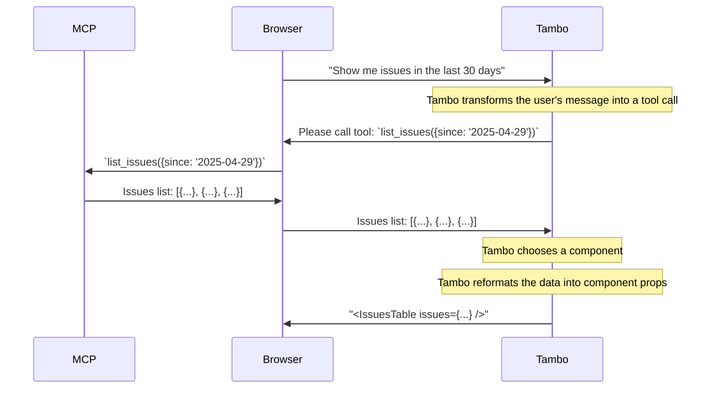

### 2. Client-Side Support

Client-side MCP integration allows your application to connect to MCP servers
that are accessible from the end user's browser, for instance when using a local
MCP server.

This is useful for:

- Local MCP servers running on the user's machine
- MCP servers where the user's browser is already authenticated
- Private or internal services behind a firewall, that are only visible from the user's browser

**Note:** _There is currently no support for authenticated MCP servers when using the client-side MCP provider_.

To implement client-side MCP support, use the `TamboMcpProvider` component inside your `TamboProvider`:

```tsx
import { TamboProvider } from "@tambo-ai/react";
import { TamboMcpProvider, MCPTransport } from "@tambo-ai/react/mcp";

function MyApp() {
  return (
    <TamboProvider components={...}>
      <TamboMcpProvider
        mcpServers={[
          {
            // MCP server configuration
            url: "http://localhost:8123/",
            // Optional custom headers, eg.
            // { "Authorization": `Bearer ${token}` } or { "X-Api-Key": "1234567890" }
            customHeaders: {},
            transport: MCPTransport.HTTP, // optional, defaults to SSE
          },
        ]}
      >
        {/* Your application components */}
      </TamboMcpProvider>
    </TamboProvider>
  );
}
```

The `TamboMcpProvider` establishes connections to the specified MCP servers and makes their tools available to Tambo agents in your application.

This is how client-side MCP works:


