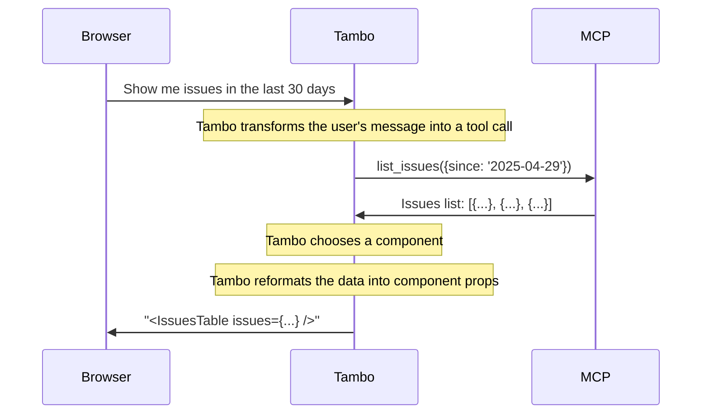

### 1. Server-Side Support (recommended)

Server-side MCP integration allows you to configure MCP servers at the project
level through the Tambo dashboard. This generally gives the best end-user performance and
allows you to use OAuth-based authentication.

This approach is beneficial when:

- MCP servers need to be shared across all users of your application
- The MCP server is accessible from your Tambo backend
- You need to use an MCP server that requires authentication

To configure server-side MCP:

1. Navigate to [your project dashboard](https://tambo.co/dashboard)
2. Click on your project
3. Find the "MCP Servers" section
4. Click "Add MCP Server"
5. Enter the server URL and server type (StreamableHTTP or SSE), and click the save button.
6. Tambo will automatically detect if an MCP server requires authentication. If so, the "Begin Authentication" button will be shown. Click it to begin the authentication process.

Once configured, the MCP servers will be available to all users of your project without any additional client-side setup.

**Note:** _When an MCP server is authenticated, the authenticated user is currently shared across **all** users of the project. In the future Tambo will support per-user authentication._

If your server does not support OAuth-based authentication, you can add a custom header to the MCP server configuration. (e.g. `X-Api-Key`)

This is how server-side MCP works:

