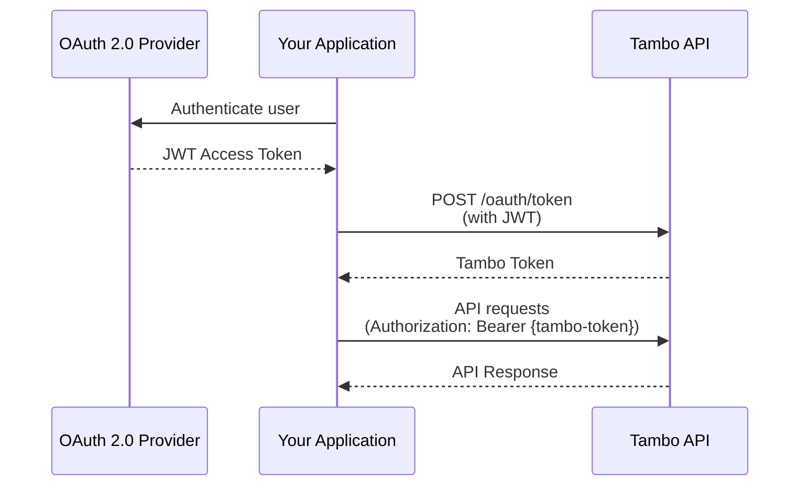

In a Tambo application, each user has their own threads and messages,
and does not have access to other users' threads and messages.

To accomplish this, Tambo supports user authentication via OAuth 2.0 [Token
Exchange](https://datatracker.ietf.org/doc/html/rfc8693). This allows you to
securely identify users with your application's identity provider.

## Supported Identity Providers

Tambo supports any OAuth 2.0 provider that provides a [JSON Web Token
(JWT)](https://datatracker.ietf.org/doc/html/rfc7519) with the `sub` claim
identifying the user. In addition, Tambo supports OpenID Connect Discovery to
automatically verify the token without any additional configuration. This
includes most common identity providers such as Google, Microsoft, and Auth0.

**Note**: As of July 2025, Supabase auth does not support Asymmetric JWT
Verification. When using Supabase auth with Tambo, you will need to disable JWT
verification in your project settings.

If your application does not support OpenID Connect Discovery, you can still
use Tambo's user authentication by configuring your project's JWT verification
strategy.

**Note**: While it is possible to pass in a `contextKey` to identify the user in
most Tambo APIs, this is not a secure way to identify users, as each `contextKey`
is just an unverified string. Using the OAuth 2.0 Token Exchange flow is the
recommended way to identify users.

## How it works

User authentication is a three-step process:

1. Your application authenticates with the OAuth 2.0 provider and gets back a JWT access token.
2. Your application sends the JWT access token to Tambo on the `/oauth/token`
   endpoint, which will return a Tambo token.
3. Every API request to Tambo must include the Tambo token in the `Authorization` header.



## How to use it

The easiest way to use user authentication is to use `TamboProvider` from the `@tambo-ai/react` package.

```tsx title="layout.tsx"
import { TamboProvider } from "@tambo-ai/react";

export default function Layout({ children }: { children: React.ReactNode }) {
  // Acquire the user token from your application's authentication system.
  const userToken = useUserToken();
  return <TamboProvider userToken={userToken}>{children}</TamboProvider>;
}
```

When pass a user token to `TamboProvider`, Tambo will automatically verify the user token and
use the `sub` claim to identify the user. In addition, Tambo will automatically
refresh the Tambo token when it expires, or re-request a new Tambo token if the
user token changes.

## How to configure your project's JWT verification strategy

If your application does not support OpenID Connect Discovery, you can still
use Tambo's user authentication by configuring your project's JWT verification
strategy.

Tambo supports 4 different JWT verification strategies:

- **OpenID Connect Discovery**: Tambo will automatically verify the user token
  using OpenID Connect Discovery by contacting the user's identity provider's
  discovery endpoint during token exchange. **This is the default strategy** and
  requires that your Identity Provider supports Asymmetric JWT signatures.
- **Asymmetric JWT Verification**: This is the same as OpenID Connect Discovery, except that you can provide
  a public key to verify the user token.
- **Symmetric JWT Verification**: Tambo will verify the user token using a
  private key which you can provide. This is an insecure strategy and should
  generally only be used for testing, as it requires you to share your private
  key with Tambo.
- **None**: No verification is performed.

All of these strategies can be configured in your project dashboard under
Settings > User Authentication.
