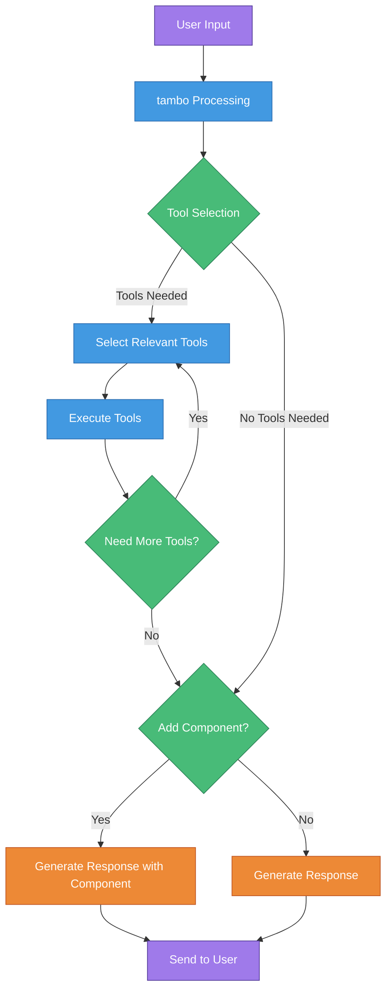

Learn how tambo processes user input and makes intelligent decisions.

```mermaid
graph TD
A[User Input] --> B[tambo Processing]
B --> C{Tool Selection}

C -->|Tools Needed| D[Select Relevant Tools]
D --> E[Execute Tools]
E --> F{Need More Tools?}

F -->|Yes| D
F -->|No| G{Add Component?}

C -->|No Tools Needed| G

G -->|Yes| H[Generate Response with Component]
G -->|No| I[Generate Response]

H --> J[Send to User]
I --> J


%% User interaction nodes - purple theme
style A fill:#9f7aea,stroke:#553c9a,color:#ffffff
style J fill:#9f7aea,stroke:#553c9a,color:#ffffff

%% Processing nodes - blue theme
style B fill:#4299e1,stroke:#2b6cb0,color:#ffffff
style D fill:#4299e1,stroke:#2b6cb0,color:#ffffff
style E fill:#4299e1,stroke:#2b6cb0,color:#ffffff

%% Decision nodes - green theme
style C fill:#48bb78,stroke:#2f855a,color:#ffffff
style F fill:#48bb78,stroke:#2f855a,color:#ffffff
style G fill:#48bb78,stroke:#2f855a,color:#ffffff

%% Response nodes - orange theme
style H fill:#ed8936,stroke:#c05621,color:#ffffff
style I fill:#ed8936,stroke:#c05621,color:#ffffff
```
